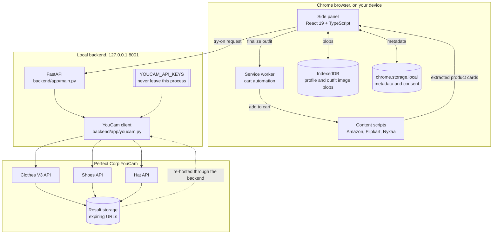
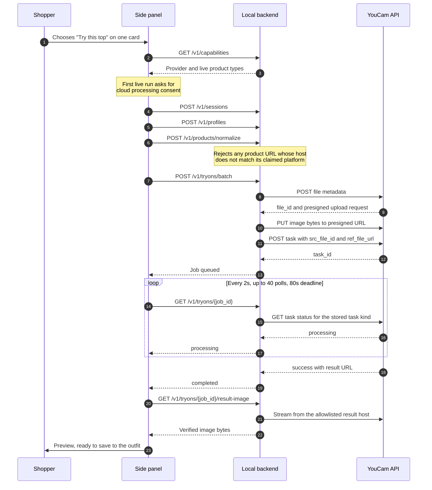
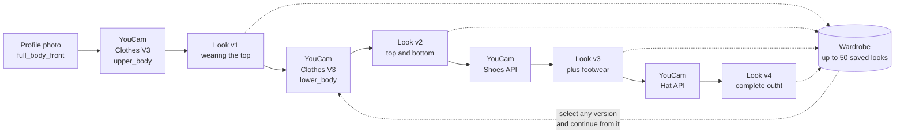
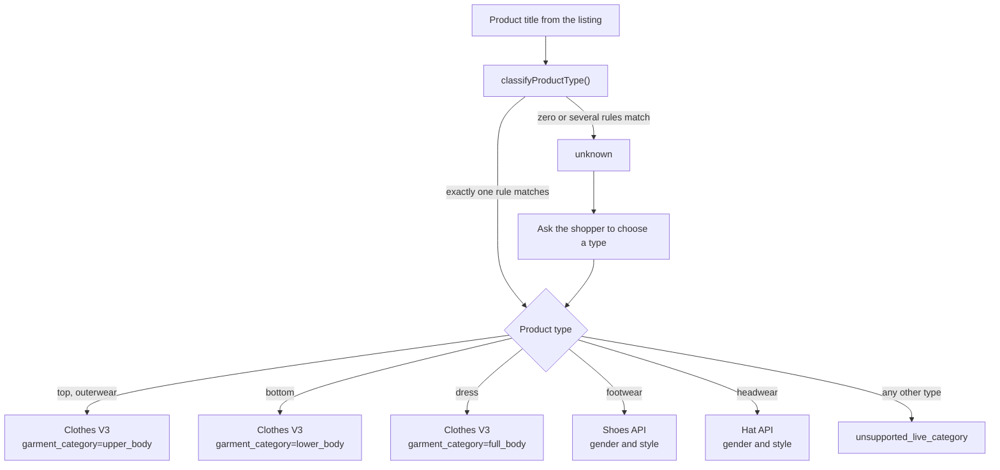
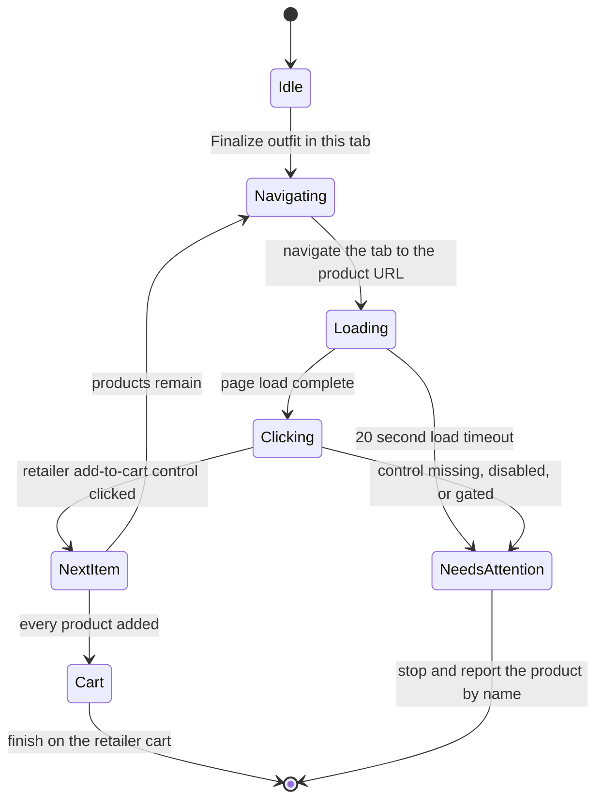

<div align="center">

<picture>
  <source media="(prefers-color-scheme: dark)" srcset="docs/assets/logo-dark.svg">
  
</picture>

### Try clothes on yourself while you shop, without leaving the store.

Yourdrobe is a Chrome side panel that reads product listings from Amazon, Flipkart, and Nykaa,
renders them onto a photo of you with the **Perfect Corp YouCam API**, and stacks each result
into one complete outfit that it can push straight to the retailer's cart.

<br>

[](https://docs.perfectcorp.com/)
[](https://docs.perfectcorp.com/reference/ai_clothes/section/overview)
[](extension/public/manifest.json)

[](backend/requirements.txt)
[](backend/app/main.py)
[](extension/package.json)
[](extension/tsconfig.json)
[](extension/vite.config.ts)
[](#testing)

</div>

---

## Contents

- [What Yourdrobe does](#what-yourdrobe-does)
- [Inside the YouCam integration](#inside-the-youcam-integration)
- [System architecture](#system-architecture)
- [Workflows](#workflows)
  - [Try-on request lifecycle](#try-on-request-lifecycle)
  - [Outfit composition loop](#outfit-composition-loop)
  - [YouCam task routing](#youcam-task-routing)
  - [Finalize to cart](#finalize-to-cart)
- [Repository layout](#repository-layout)
- [Prerequisites](#prerequisites)
- [Setup](#setup)
- [Running Yourdrobe](#running-yourdrobe)
- [Configuration reference](#configuration-reference)
- [API reference](#api-reference)
- [Support matrix](#support-matrix)
- [Privacy and data handling](#privacy-and-data-handling)
- [Testing](#testing)
- [Troubleshooting](#troubleshooting)
- [Known limitations](#known-limitations)

---

## What Yourdrobe does

You browse a normal product listing. Yourdrobe reads the cards on that page, and every
recognized product grows its own try-on action. Pick one, and it comes back rendered on you.
Save it, pick the next product, and the new preview builds on top of the last one. When the
look is finished, Yourdrobe drives the same tab through each product and adds it to the cart.

| Capability | What it means |
| --- | --- |
| Shop in place | Content-script adapters read product cards straight from Amazon India, Amazon US, Flipkart, and Nykaa listings |
| Search from the panel | Choose a store, type a query, and the active tab navigates to those results with up to 25 products per page |
| One product at a time | Every recognized card carries its own try-on action, so only the item you choose is sent for rendering |
| Layered outfits | Each saved YouCam result becomes the source image for the next call, so a top, a bottom, shoes, and a hat compose into one look |
| Wardrobe history | Up to 50 compiled looks are kept on device and browsable in a carousel that restores both the image and its product list |
| One-tab checkout | Finalize walks the current tab through every selected product, uses the retailer's own add-to-cart control, and ends on the cart |
| Local by default | Profile photos, outfits, and metadata stay in IndexedDB and `chrome.storage.local` on your machine |

---

## Inside the YouCam integration

The try-on engine is the Perfect Corp YouCam API, and it is the substance of this project.
Yourdrobe does not call one endpoint and render the answer. It drives three different YouCam
task families from a single flow, routes each product to the right one automatically, and
wraps the whole thing in key rotation, error classification, and result persistence.

All of the provider code lives in [`backend/app/youcam.py`](backend/app/youcam.py).

### Three YouCam task families, one flow

| Product type | YouCam API | Task endpoint | Parameters sent |
| --- | --- | --- | --- |
| `top`, `outerwear` | Clothes V3 | `/s2s/v2.0/task/cloth-v3` | `garment_category=upper_body` |
| `bottom` | Clothes V3 | `/s2s/v2.0/task/cloth-v3` | `garment_category=lower_body` |
| `dress` | Clothes V3 | `/s2s/v2.0/task/cloth-v3` | `garment_category=full_body` |
| `footwear` | Shoes | `/s2s/v2.0/task/shoes` | `gender`, `style` |
| `headwear` | Hat | `/s2s/v2.0/task/hat` | `gender`, `style` |

### Automatic garment category routing

A product title never states its garment category, so Yourdrobe derives it. A regex classifier
in [`extension/src/product-type.ts`](extension/src/product-type.ts) maps the listing title to one
of fifteen product types, deliberately returning `unknown` when two rules both match rather than
guessing. The backend then maps that type onto the correct YouCam endpoint and category through
`YOUCAM_MAPPING` in [`backend/app/main.py`](backend/app/main.py). A blazer and a hoodie both reach
Clothes V3 as `upper_body`, a saree reaches it as `full_body`, and a pair of loafers is handed to
the Shoes API instead. Ambiguous products stop and ask the shopper rather than sending a wrong
category.

### The full server-to-server upload protocol

YouCam does not accept image bytes on the task endpoint. Yourdrobe implements the complete
three-step handshake in `_create_task`:

1. `POST` the file metadata (content type, file name, byte length) to the file endpoint and
   receive a `file_id` together with a presigned upload request.
2. `PUT` the raw image bytes to that presigned URL, replaying the exact headers YouCam returned.
3. `POST` the task, binding the uploaded `src_file_id` to the retailer's `ref_file_url`.

The same three steps serve Clothes V3, Shoes, and Hat, with only the path and the parameter
dictionary changing, so adding a fourth YouCam family is a small change rather than a rewrite.

### Multi-key rotation with failure classification

`YOUCAM_API_KEYS` accepts a comma separated list. Keys are deduplicated, preserved in order, and
tried in sequence. Any `401`, `403`, `429`, or `5xx` moves to the next key instead of failing the
request, and a transport error does the same.

What makes this useful is that the loop remembers *why* every key failed. If every key answered
`429`, the caller gets `youcam_rate_limited` and is told to retry shortly. If the failures were
mixed, the caller gets `youcam_keys_exhausted`, which is a configuration problem, not a timing
one. Two very different fixes, two different messages.

### Provider errors normalized into actionable classes

YouCam reports failures through varied codes across its endpoints. Rather than leaking them to
the UI, `_error_code` folds them into four classes by inspecting the provider code:

| Class | Triggered by | What the shopper is told |
| --- | --- | --- |
| `provider_safety_rejection` | codes containing `nsfw` or `safety` | The request was rejected for safety reasons |
| `invalid_product_image` | codes containing `ref` or `download` | That product image could not be used |
| `invalid_user_image` | codes containing `src`, `pose`, `image`, or `face` | That photo of you could not be used |
| `provider_processing_failed` | anything else | The preview could not be completed |

Each class maps to a message that tells the shopper which input to change.

### Polling that knows which task it started

A started task records its `task_id`, the index of the key that created it, and its task kind.
Polling in `get_task` uses the stored kind to hit the matching status endpoint, and it reuses the
same key that created the task, since a task is not visible to a different key.

Transient network failure during polling reports `processing` rather than `failed`, so a dropped
packet does not throw away a render that is still running on YouCam's side.

### Results re-hosted so outfits survive

YouCam result URLs expire. If Yourdrobe stored the URL, saved outfits would rot. Instead
`download_result` streams the result through the backend under strict conditions:

- The host must match `yce-*.s3-accelerate.amazonaws.com`, enforced as an allowlist
- The scheme must be HTTPS and redirects are not followed
- The response must be `image/jpeg` or `image/png`
- Streaming aborts past 10 MB

The extension saves those bytes locally, which is what makes the wardrobe durable and the
composition loop possible.

### The composition loop

This is the feature the rest of the integration exists to support. When a preview is saved, its
bytes become `outfit_base_image_data_url` on the next `/v1/tryons/batch` call. That means the
second YouCam request does not render a bottom onto your original photo. It renders it onto the
image YouCam already produced wearing the top.

A shopper can chain Clothes V3, then Shoes, then Hat, and finish with one image wearing all
three. Because the active outfit stands in for the profile photo, the backend also relaxes its
`full_body_front` requirement whenever an outfit base is supplied.

### Preview model selection for Shoes and Hat

The Shoes and Hat endpoints take a `gender` parameter that shapes the rendered model. Yourdrobe
surfaces this as a Women or Men choice on those cards, and the try-on action stays disabled until
the choice is made, so the request is never sent with a parameter YouCam would reject.

### Mock and live parity

With no keys configured the backend serves the identical job contract with `mock: true`, letting
the entire flow be developed and tested without spending provider units. The moment keys are
present, mock is gone: a provider failure stays a failure and is reported as one. Yourdrobe never
quietly serves a fake preview while pretending it is real.

---

## System architecture



The local backend exists for one reason: it is the trust boundary. API keys are read from the
environment into the backend process and are never bundled into the extension, never sent to the
browser, and never returned by any endpoint. The extension only ever talks to `127.0.0.1:8001`.

---

## Workflows

### Try-on request lifecycle



### Outfit composition loop



Every arrow from a look into the next YouCam call passes that look's saved bytes as
`outfit_base_image_data_url`. Selecting an older version from the wardrobe restores both its
image and its product list, so you can branch a different outfit from any point in the history.

### YouCam task routing



### Finalize to cart



A product that needs a size, a colour, a sign in, or a CAPTCHA stops the sequence on its own
page for you to finish by hand. Yourdrobe reports it as needing attention rather than counting
it as added.

---

## Repository layout

```
.
├── backend/                          Local FastAPI service, the API key trust boundary
│   ├── app/
│   │   ├── main.py                   Endpoints, job orchestration, product host validation
│   │   ├── youcam.py                 YouCam client: Clothes V3, Shoes, Hat, key rotation
│   │   └── profile_generation.py     Profile view generation
│   ├── tests/                        unittest suites for the API, YouCam client, and profiles
│   ├── requirements.txt
│   └── .env.example
├── docs/
│   ├── assets/                       Logo lockups and mark
│   └── superpowers/                  Design specs and implementation plans
└── extension/                        Manifest V3 Chrome extension
    ├── public/manifest.json
    ├── src/
    │   ├── background/               Service worker and the cart sequencer
    │   ├── content/                  Retailer adapters and the add-to-cart control
    │   ├── components/ui/            Reusable UI primitives
    │   ├── profile/                  Local storage, image preparation, asset requirements
    │   ├── sidepanel/                React side panel and backend client
    │   └── product-type.ts           Listing title to product type classifier
    ├── package.json
    └── vite.config.ts
```

---

## Prerequisites

| Requirement | Version | Notes |
| --- | --- | --- |
| Python | 3.10 or newer | The backend uses `X \| None` type syntax |
| Node.js | 20 or newer | Required by Vite 8 |
| Google Chrome | Any current release | Manifest V3 with side panel support |
| Perfect Corp YouCam API key | One or more | Optional. Without a key the backend runs in mock mode |

The commands below are PowerShell, matching the primary development environment. On macOS or
Linux, replace `backend/.venv/Scripts/python.exe` with `backend/.venv/bin/python` and set
environment variables with `export` instead of `$env:`.

---

## Setup

### 1. Backend

From the repository root, create the virtual environment and install dependencies:

```powershell
python -m venv backend/.venv
backend/.venv/Scripts/python.exe -m pip install -r backend/requirements.txt
```

### 2. Extension

In a second terminal, install dependencies and build the unpacked extension:

```powershell
npm.cmd --prefix extension install
npm.cmd --prefix extension run build
```

The build runs `tsc --noEmit` before Vite, so a type error fails the build rather than shipping.

### 3. Load into Chrome

1. Open `chrome://extensions`
2. Enable **Developer mode**
3. Choose **Load unpacked**
4. Select `extension/dist`
5. Open a search or category listing on Amazon India, Amazon US, Flipkart, or Nykaa
6. Click the extension action to open the Yourdrobe side panel

---

## Running Yourdrobe

### Mock mode

Mock mode is the default whenever no YouCam key is configured. Every endpoint keeps its normal
shape, jobs complete with `mock: true`, and results are labelled `Mock AI preview`, so the whole
flow can be developed and tested without spending provider units.

To force mock mode even when `backend/.env` holds real keys, set a comma-only value in the
process environment. It takes precedence over the file, parses as zero keys, and leaves
`backend/.env` untouched:

```powershell
$env:YOUCAM_API_KEYS=','
$env:PYTHONPATH='backend'
backend/.venv/Scripts/python.exe -m uvicorn app.main:app --reload --port 8001
```

### Live YouCam mode

Copy the example environment file and add one or more real keys:

```powershell
Copy-Item backend/.env.example backend/.env
# Edit backend/.env and set YOUCAM_API_KEYS=first-api-key,second-api-key
$env:PYTHONPATH='backend'
backend/.venv/Scripts/python.exe -m uvicorn app.main:app --reload --port 8001
```

Keys are tried in the order listed. A process variable overrides the file if you need to switch
keys without editing it:

```powershell
$env:YOUCAM_API_KEYS='first-api-key,second-api-key'
```

Confirm the mode the backend came up in:

```powershell
curl.exe http://127.0.0.1:8001/v1/capabilities
```

A live backend reports `"tryon_provider": "youcam"` and lists the live product types. A mock
backend reports `"tryon_provider": "mock"` with an empty list.

> **Note**
> Try-on requires a saved profile, and profile creation calls a separate image generation
> service configured through the profile generation variables in the
> [configuration reference](#configuration-reference). If those are not set, profile setup
> returns `503` and the try-on flow cannot be reached. YouCam keys alone are not sufficient to
> complete a first run from scratch.

### First run

1. Open the side panel on a supported listing and create your profile from one clear, well lit,
   head to toe photo
2. Review every generated view before saving, then save the profile
3. Accept cloud processing when prompted on the first live try-on
4. Choose a product card and select its try-on action
5. Save the result with **Add this to active outfit**
6. Pick the next product and repeat to layer the outfit
7. Select **Finalize outfit in this tab** to add everything to the retailer cart

---

## Configuration reference

All configuration is read by the backend process only. Nothing here is bundled into the
extension, and no endpoint returns any of these values.

### Try-on

| Variable | Required for | Default | Purpose |
| --- | --- | --- | --- |
| `YOUCAM_API_KEYS` | Live previews | empty | Comma separated Perfect Corp YouCam keys. Deduplicated, tried in listed order, with automatic failover on `401`, `403`, `429`, and `5xx`. Empty means mock mode |

### Profile generation

Profile creation uses a separate image generation service. These variables gate that step only.
Refer to [`backend/.env.example`](backend/.env.example) for the current default values.

| Variable | Required for | Purpose |
| --- | --- | --- |
| `GOOGLE_APPLICATION_CREDENTIALS` | Profile creation | Absolute path to the service account credential file, kept outside the working tree |
| `GOOGLE_CLOUD_PROJECT` | Optional | Project override. Detected from the credential when unset |
| `GOOGLE_CLOUD_LOCATION` | Optional | Region for the generation service |
| `NANO_BANANA_MODEL` | Optional | Model identifier for the generation service |

Values are loaded from `backend/.env` by default. A process environment variable always takes
precedence over the file, which is what makes the mock-mode override work without editing
anything on disk.

> **Warning**
> Never commit API keys or credential files. `.gitignore` already excludes `.env`,
> `*-sa-key.json`, and `*-service-account*.json`. Keep credential files outside the working tree
> and reference them by absolute path.

---

## API reference

The backend listens on `http://127.0.0.1:8001`.

| Method | Path | Purpose |
| --- | --- | --- |
| `GET` | `/health` | Liveness probe |
| `GET` | `/v1/capabilities` | Reports whether YouCam is configured and which product types have a live path |
| `POST` | `/v1/sessions` | Opens a session |
| `POST` | `/v1/profiles` | Registers the profile photo roles available for a session |
| `POST` | `/v1/profiles/generate-assets` | Generates the profile views from one source photo |
| `POST` | `/v1/products/normalize` | Validates and registers products, rejecting any host that does not match its claimed platform |
| `POST` | `/v1/tryons/batch` | Starts YouCam tasks for the selected products |
| `GET` | `/v1/tryons/{job_id}` | Polls job status |
| `GET` | `/v1/tryons/{job_id}/result-image` | Re-hosts a completed YouCam result as verified image bytes |

### Request limits

| Limit | Value | Enforced in |
| --- | --- | --- |
| Products per normalize call | 5 | `NormalizeInput` |
| Products per try-on batch | 5 | `BatchInput.product_ids` |
| Profile assets per request | 11 | `ProfileInput.assets` |
| Image data URL length | 14,000,000 characters | `ProfileAssetInput` |
| Image bytes sent to YouCam | Under 10 MB | `youcam.MAX_IMAGE_BYTES` |
| Stored sessions, profiles, products, jobs | 100 each, oldest evicted | `MAX_STORED_ITEMS` |

### Error codes

Request level failures are returned as HTTP errors. Provider level failures are attached to the
job, so one product failing never takes down a batch.

| Code | Level | Meaning |
| --- | --- | --- |
| `live_consent_required` | HTTP 400 | Cloud processing consent has not been granted yet |
| `missing_profile_assets` | HTTP 422 | The profile lacks a photo role the selected products need |
| `provider_result_unavailable` | HTTP 502 | The result URL failed the host allowlist or the content checks |
| `youcam_rate_limited` | Job | Every configured key answered `429`. Retry shortly |
| `youcam_keys_exhausted` | Job | No configured key could start the task. Check the keys |
| `invalid_user_image` | Job | YouCam could not use the source photo |
| `invalid_product_image` | Job | YouCam could not use the retailer product image |
| `provider_safety_rejection` | Job | YouCam rejected the request on safety grounds |
| `provider_processing_failed` | Job | YouCam could not complete the render |
| `unsupported_live_category` | Job | The product type has no YouCam path |
